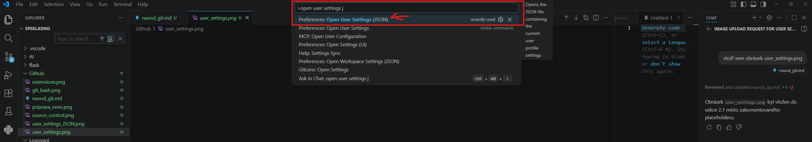
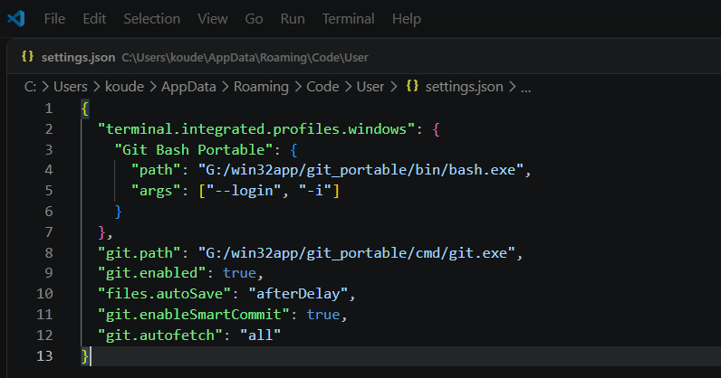
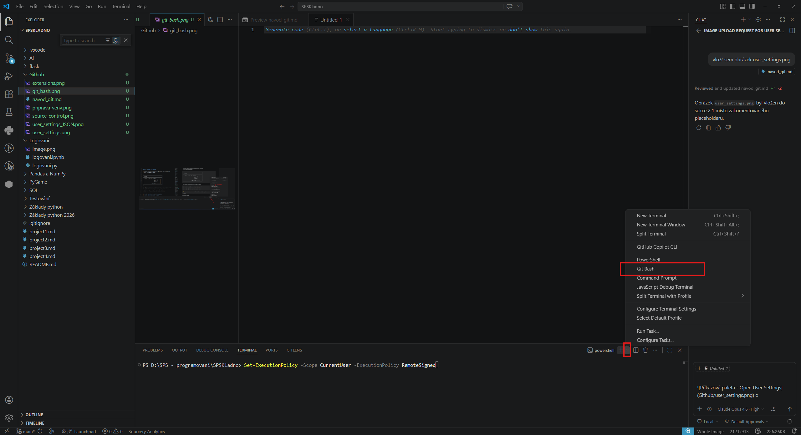
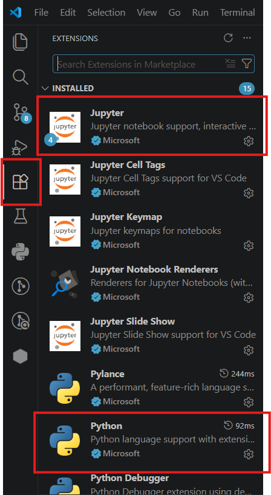
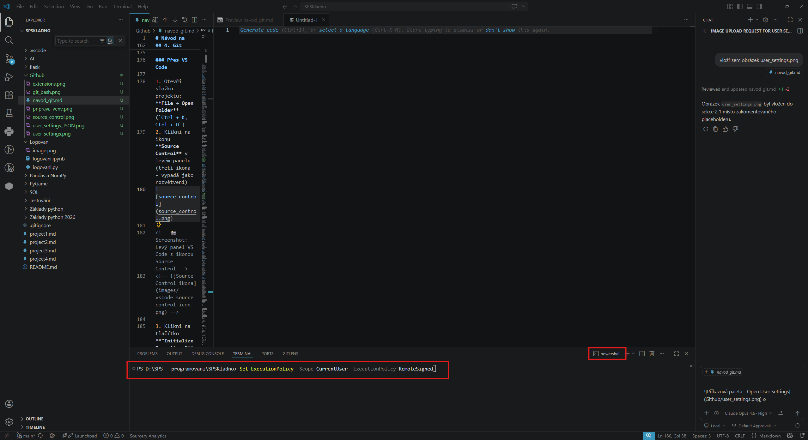
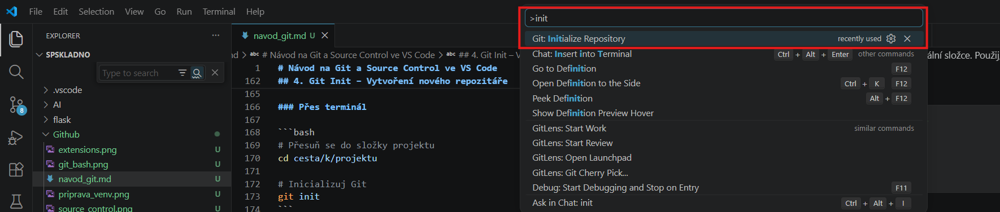
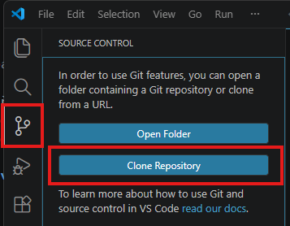
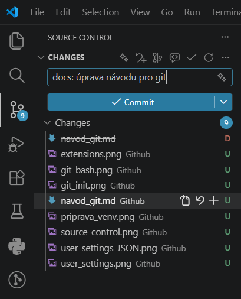
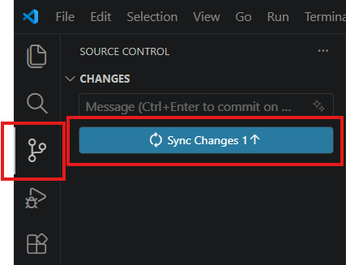

# Návod na Git a Source Control ve VS Code

## Obsah

1. [Co je Git a proč ho používat?](#1-co-je-git-a-proč-ho-používat)
2. [Nastavení Gitu na školních PC](#2-nastavení-gitu-na-školních-pc)
3. [Základní pojmy](#3-základní-pojmy)
4. [Git Init – Vytvoření nového repozitáře](#4-git-init--vytvoření-nového-repozitáře)
5. [Git Clone – Stažení existujícího repozitáře](#5-git-clone--stažení-existujícího-repozitáře)
6. [Sledování změn: Add, Commit](#6-sledování-změn-add-commit)
7. [Git Push – Odeslání změn na server](#7-git-push--odeslání-změn-na-server)
8. [Git Pull – Stažení změn ze serveru](#8-git-pull--stažení-změn-ze-serveru)
9. [Git Branch – Práce s větvemi](#9-git-branch--práce-s-větvemi)
10. [Git Merge – Sloučení větví](#10-git-merge--sloučení-větví)
11. [Git Rebase – Přeskládání větví](#11-git-rebase--přeskládání-větví)
12. [Merge vs. Rebase – Kdy co použít?](#12-merge-vs-rebase--kdy-co-použít)
13. [Řešení konfliktů](#13-řešení-konfliktů)
14. [Tahák – Přehled příkazů](#14-tahák--přehled-příkazů)

---

## 1. Co je Git a proč ho používat?

**Git** je systém pro správu verzí (version control). Umožňuje:

- 📜 **Uchovávat historii** – kdykoli se vrátit k předchozí verzi kódu
- 👥 **Spolupracovat** – více lidí může pracovat na jednom projektu současně
- 🔀 **Vytvářet větve** – experimentovat s novými funkcemi bez ohrožení hlavního kódu
- ☁️ **Zálohovat kód** – na vzdálený server (GitHub, GitLab…)

```
Bez Gitu:                          S Gitem:
projekt_final.py                   projekt.py
projekt_final2.py                    └── Git historie:
projekt_final_OPRAVDU_final.py           ├── verze 1 (začátek)
projekt_final_v3.py                      ├── verze 2 (přidán login)
projekt_kopie_backup.py                  ├── verze 3 (oprava bugu)
                                         └── verze 4 (nový design)
```

---

## 2. Nastavení Gitu na školních PC

> ⚠️ Ve škole je Git nainstalován jako **portable verze na serveru**. Následující kroky je potřeba udělat, aby vše fungovalo.

### Jednorázové nastavení (Část A)

#### 2.1 Nastavení VS Code (settings.json)

1. Otevři VS Code
2. Stiskni `Ctrl + Shift + P` (otevře se příkazová paleta nahoře)
3. Napiš **"Open User Settings (JSON)"** a klikni na výsledek




4. Do otevřeného souboru vlož tuto konfiguraci:


```json
{
  "terminal.integrated.profiles.windows": {
    "Git Bash Portable": {
      "path": "G:/win32app/git_portable/bin/bash.exe",
      "args": ["--login", "-i"]
    }
  },
  "git.path": "G:/win32app/git_portable/cmd/git.exe",
  "git.enabled": true,
  "files.autoSave": "afterDelay",
  "git.enableSmartCommit": true,
  "git.autofetch": "all"
}
```

> ⚠️ Pokud už v souboru nějaké nastavení máš, přidej pouze jednotlivé položky – neduplikuj vnější složené závorky `{}`.

Poté restartujte VS Code, případně stiskni `Ctrl + Shift + P` (otevře se příkazová paleta nahoře) a napiš `reload windows`

#### 2.2 Nastavení Git identity

1. V dolní liště VS Code klikni na šipku vedle **+** u terminálu
2. Vyber **Git Bash Portable**




3. Zadej tyto příkazy (nahraď svými údaji z GitHubu):

```bash
git config --global user.email "tvuj@email.cz"
git config --global user.name "TvujNick"
git config --global credential.helper store
```

> 🔑 `credential.helper store` uloží tvé přihlašovací údaje, abys je nemusel/a zadávat pokaždé.

#### 2.3 Instalace rozšíření

Stiskni `Ctrl + Shift + X` a nainstaluj:

- **Python** (`ms-python.python`)
- **Jupyter** (`ms-toolsai.jupyter`)

---



### Kroky pro každý nový projekt / po restartu PC (Část B)

#### 2.4 Povolení spouštění skriptů

Školní politika toto nastavení resetuje po restartu. V **PowerShell** terminálu spusť:



```powershell
Set-ExecutionPolicy -Scope CurrentUser -ExecutionPolicy RemoteSigned
```

#### 2.5 Vytvoření a aktivace virtuálního prostředí

```powershell
# Vytvoření venv
& "G:/win32app/Portable Python-3.13.3 x64/python.exe" -m venv venv

# Aktivace venv
.\venv\Scripts\activate
```
---

## 3. Základní pojmy

| Pojem | Význam |
|-------|--------|
| **Repository (repozitář)** | Složka projektu sledovaná Gitem |
| **Commit** | "Snímek" kódu v daném okamžiku – uložený bod v historii |
| **Branch (větev)** | Samostatná linie vývoje |
| **Remote** | Vzdálený server (např. GitHub) |
| **Origin** | Výchozí název pro vzdálený repozitář |
| **HEAD** | Ukazatel na aktuální pozici v historii |
| **Staging area** | Přípravná oblast – soubory připravené ke commitu |
| **Working directory** | Tvá pracovní složka s aktuálními soubory |

### Jak Git funguje – tři oblasti

```
┌──────────────────┐     git add      ┌─────────────────┐    git commit   ┌─────────────────┐
│   Working Dir    │ ───────────────► │  Staging Area   │ ──────────────► │   Repository    │
│ (tvé soubory)    │                  │ (připraveno ke  │                 │   (historie)    │
│                  │                  │     commitu)    │                 │                 │
└──────────────────┘                  └─────────────────┘                 └─────────────────┘
        ▲                                                                        │
        │                          git checkout / restore                        │
        └────────────────────────────────────────────────────────────────────────┘
```

<!-- 📸 Screenshot: Diagram tří oblastí Gitu (Working Dir → Staging → Repository) -->
<!--  -->

---

## 4. Git Init – Vytvoření nového repozitáře

`git init` vytvoří nový repozitář v aktuální složce. Použij, když **začínáš úplně nový projekt**.

### Přes terminál

```bash
# Přesuň se do složky projektu
cd cesta/k/projektu

# Inicializuj Git
git init
```

### Přes VS Code

1. Otevři složku projektu: **File → Open Folder** (`Ctrl + K, Ctrl + O`)
2. Použij zkratku `Ctrl + Shift + P` pro otevření příkazové palety a napiš **"Git: Initialize Repository"**



> 💡 Tímto se ve složce vytvoří skrytá složka `.git`, která obsahuje veškerou historii.

---

## 5. Git Clone – Stažení existujícího repozitáře

`git clone` stáhne celý repozitář ze vzdáleného serveru (např. z GitHubu). Použij, když chceš **pracovat na existujícím projektu**.

### Přes terminál

```bash
# Stažení do nové podsložky
git clone https://github.com/uzivatel/nazev-repozitare.git

# Stažení přímo do aktuální složky (nezapomeň na tečku!)
git clone https://github.com/uzivatel/nazev-repozitare.git .
```

> ⚠️ Tečka `.` na konci = obsah se naklonuje **přímo do aktuální složky** (nevytvoří se podsložka).

### Přes VS Code



**NEBO**

1. Stiskni `Ctrl + Shift + P`
2. Napiš **"Git: Clone"**

```
┌──────────────────────────────────────────────────┐
│  > Git: Clone                                    │  ← vyber tuto možnost
│    Git: Clone (Recursive)                        │
└──────────────────────────────────────────────────┘
```

<!-- 📸 Screenshot: Příkazová paleta s "Git: Clone" -->
<!--  -->

3. Vlož URL repozitáře z GitHubu
4. Vyber cílovou složku na disku
5. VS Code nabídne otevření naklonovaného repozitáře – klikni **Open**

### Kdy použít init vs. clone?

| Situace | Příkaz |
|---------|--------|
| Začínám **úplně nový** projekt | `git init` |
| Stahuju **existující** projekt z GitHubu | `git clone` |

---

## 6. Sledování změn: Add, Commit

Po úpravě souborů je potřeba změny **přidat do staging area** a pak **commitnout**.

### Přes terminál

```bash
# Přidání konkrétního souboru
git add soubor.py

# Přidání všech změněných souborů
git add .

# Vytvoření commitu s popisem
git commit -m "Přidána funkce pro výpočet průměru"
```

### Přes VS Code (doporučený způsob)

1. Otevři **Source Control** panel (ikona v levém panelu nebo `Ctrl + Shift + G`)
2. Uvidíš seznam změněných souborů pod **"Changes"**
3. Kliknutím na **+** u souboru ho přidáš do staging area (přesune se do **"Staged Changes"**)
4. Napiš zprávu commitu do textového pole nahoře
5. Klikni na **✓ Commit** (fajfka)

```
┌──────────────────────────────────────────────────┐
│ SOURCE CONTROL                                   │
│                                                  │
│  ┌──────────────────────────────────────────┐    │
│  │ Přidána funkce pro výpočet průměru       │    │  ← napiš zprávu
│  └──────────────────────────────────────────┘    │
│  [✓ Commit]                                      │  ← klikni pro commit
│                                                  │
│  STAGED CHANGES (připraveno)                     │
│    M  utils.py                          ↺  ─     │  ← soubory připravené ke commitu
│                                                  │
│  CHANGES (změněno)                               │
│    M  main.py                           +  ↺     │  ← + přidá do staged
│    U  novy_soubor.py                    +  ↺     │
│                                                  │
│  Symboly:  M = Modified (upraven)                │
│            U = Untracked (nový, nesledovaný)     │
│            D = Deleted (smazán)                  │
│            + = přidat do staged                  │
│            ↺ = vrátit změny                      │
└──────────────────────────────────────────────────┘
```



### Conventional Commits – norma pro commit zprávy

Profesionální projekty používají standard **Conventional Commits** ([conventionalcommits.org](https://www.conventionalcommits.org/)). Každá zpráva má pevný formát:

```
<typ>(<oblast>): <krátký popis>
```

#### Typy commitů

| Typ | Kdy použít | Příklad |
|-----|-----------|---------|
| `feat` | Nová funkce / vlastnost | `feat: přidán login formulář` |
| `fix` | Oprava chyby | `fix: opraven výpočet průměru` |
| `docs` | Změna v dokumentaci | `docs: aktualizován README` |
| `style` | Formátování, středníky, odsazení (ne CSS!) | `style: opraveno odsazení v main.py` |
| `refactor` | Přepis kódu bez změny chování | `refactor: zjednodušena funkce sort` |
| `test` | Přidání nebo úprava testů | `test: přidány testy pro API` |
| `chore` | Údržba, závislosti, konfigurace | `chore: aktualizován requirements.txt` |

#### Volitelně: oblast (scope)

Oblast v závorce upřesňuje, čeho se změna týká:

```
feat(auth): přidáno přihlášení přes Google
fix(kalkulacka): opraven výpočet při dělení nulou
docs(readme): přidán návod na instalaci
```

#### Příklady správných vs. špatných zpráv

```
✅ Správně (Conventional Commits):        ❌ Špatně:
feat: přidán login formulář               "update"
fix: opravena chyba v kalkulačce (#12)    "asdf"
refactor: přepsán databázový modul        "hotovo"
test: přidány testy pro API endpoint      "změny"
docs: doplněn návod do README             "."
chore: přidán .gitignore                  "commit"
```

#### Proč tuto normu používat?

- **Přehledná historie** – na první pohled vidíš, co se stalo
- **Automatické generování changelogu** – nástroje umí z commitů vytvořit seznam změn
- **Snazší code review** – reviewer hned ví, jestli jde o novou funkci nebo opravu
- **Profesionální návyk** – používají ji firmy i open-source projekty

> 💡 **Tip:** Nastavení `"git.enableSmartCommit": true` ve VS Code automaticky přidá všechny změněné soubory do staging area při commitu – nemusíš klikat na **+** u každého souboru.

---

## 7. Git Push – Odeslání změn na server

`git push` odešle tvé lokální commity na vzdálený server (GitHub).

### Přes terminál

```bash
# Odeslání na výchozí vzdálený server (origin) a větev (main)
git push

# První push nové větve
git push -u origin nazev-vetve
```

### Přes VS Code

Po commitu se ve spodní liště VS Code zobrazí šipky vedle názvu větve:

```
┌──────────────────────────────────────────────────────────────────┐
│ ○─○  main  ↑1 ↓0              │  Ln 15, Col 4  │  UTF-8  │ ... │
│ └─○                           │                 │         │     │
│      ↑                        │                 │         │     │
│      └── ↑1 = 1 commit k odeslání (push)                       │
│          ↓0 = 0 commitů ke stažení (pull)                      │
└──────────────────────────────────────────────────────────────────┘
```

<!-- 📸 Screenshot: Spodní lišta VS Code s názvem větve a šipkami ↑↓ -->
<!--  -->

**Klikni na ↑1** nebo použi Source Control panel:

1. Klikni na **⋯** (tři tečky) v Source Control panelu
2. Vyber **Push**

```
┌──────────────────────────────┐
│ SOURCE CONTROL           ⋯   │  ← klikni na tři tečky
│                              │
│  ┌────────────────────────┐  │
│  │  Pull                  │  │
│  │  Push                  │  │  ← vyber Push
│  │  Clone                 │  │
│  │  Fetch                 │  │
│  │  ...                   │  │
│  └────────────────────────┘  │
└──────────────────────────────┘
```

<!-- 📸 Screenshot: Rozbalovací menu (⋯) v Source Control panelu s možností Push -->
<!--  -->

Nebo jednoduše klikni na ikonu **Sync Changes** (synchronizovat změny), která provede pull + push najednou:

```
┌──────────────────────────────────────────┐
│  ┌──────────────────────────────┐        │
│  │  🔄 Sync Changes  ↑1 ↓0     │        │  ← klikni pro synchronizaci
│  └──────────────────────────────┘        │
└──────────────────────────────────────────┘
```

<!-- 📸 Screenshot: Tlačítko "Sync Changes" v Source Control panelu -->


---

## 8. Git Pull – Stažení změn ze serveru

`git pull` stáhne nejnovější změny ze vzdáleného serveru a sloučí je s tvým lokálním kódem.

### Přes terminál

```bash
# Stažení a sloučení změn (klasický pull = fetch + merge)
git pull

# Stažení z konkrétní větve
git pull origin main
```

### Git Pull --rebase (doporučeno!)

Velmi častá situace: commitneš, chceš pushnout, ale dostaneš chybu:

```
! [rejected]  main -> main (fetch first)
error: failed to push some refs to 'https://github.com/...'
hint: Updates were rejected because the remote contains work that you do not have locally.
```

To znamená, že na GitHubu jsou novější commity, které ještě nemáš. Máš dvě možnosti:

#### Možnost 1: `git pull` (klasický – vytvoří merge commit)

```bash
git pull
```

```
Tvoje historie:    A ── B ── X (tvůj commit)
GitHub:            A ── B ── C (nový commit od kolegy)

Výsledek:          A ── B ── C ──── M (merge commit – "ošklivá" historie)
                        │           ↑
                        └── X ──────┘
```

#### Možnost 2: `git pull --rebase` (čistší – doporučeno ✅)

```bash
git pull --rebase
```

```
Tvoje historie:    A ── B ── X (tvůj commit)
GitHub:            A ── B ── C (nový commit od kolegy)

Výsledek:          A ── B ── C ── X' (tvůj commit přesunut NA KONEC – čistá historie)
```

Tvůj commit se automaticky přemístí **za** nové commity z GitHubu. Nevznikne žádný merge commit a historie zůstane lineární a přehledná.

#### Nastavení pull --rebase jako výchozí

Aby se `--rebase` použil **automaticky** při každém `git pull`, nastav:

```bash
git config --global pull.rebase true
```

Od teď stačí psát jen `git pull` a rebase se provede automaticky.

#### Ve VS Code

VS Code toto nastavení respektuje. Můžeš ho také přidat do `settings.json`:

```json
{
  "git.rebaseWhenSync": true
}
```

Tím bude i tlačítko **Sync Changes** provádět pull s rebase místo klasického merge.

### Typický scénář: commit → nemůžu push → pull rebase → push

```
1. Upravíš soubor, commitneš
   git add .
   git commit -m "feat: přidána kalkulačka"

2. Pokusíš se pushnout → CHYBA (remote má novější commity)
   git push
   ❌ rejected – fetch first

3. Stáhneš změny s rebase (tvůj commit se přesune na konec)
   git pull --rebase
   ✅ Successfully rebased

4. Teď už push projde
   git push
   ✅ Done
```

### Přes VS Code

1. Klikni na **⋯** v Source Control panelu → **Pull**
2. Nebo klikni na **↓** ve spodní liště
3. Nebo použi **Sync Changes** (stáhne i odešle)

### Kdy pullovat?

- **Před začátkem práce** – vždy si stáhni nejnovější verzi
- **Před pushem** – ověř, že máš aktuální kód
- **Když spolupracuješ** – pravidelně pulluj, ať nemáš velké konflikty

```
       GitHub (remote)                    Tvůj PC (local)
  ┌────────────────────┐            ┌────────────────────┐
  │ commit A           │            │ commit A           │
  │ commit B           │  git pull  │ commit B           │
  │ commit C (nový)    │ ─────────► │ commit C (nový)    │  ← stáhne nové commity
  └────────────────────┘            └────────────────────┘
```

---

## 9. Git Branch – Práce s větvemi

Větve (branches) umožňují pracovat na nových funkcích **izolovaně**, bez ovlivnění hlavního kódu.

### Proč používat větve?

```
main:        A ── B ── C ── D ── E ── F  (stabilní kód)
                       │              ↑
feature:               └── X ── Y ───┘  (nová funkce – po dokončení sloučena zpět)
```

Díky větvím:
- Hlavní větev (`main`) zůstává stabilní
- Můžeš experimentovat bez strachu, že něco rozbiješ
- Více lidí může pracovat na různých funkcích současně

### Přes terminál

```bash
# Zobrazení všech větví (* = aktuální)
git branch

# Vytvoření nové větve
git branch nova-funkce

# Přepnutí na jinou větev
git checkout nova-funkce

# Vytvoření + přepnutí najednou (doporučeno)
git checkout -b nova-funkce

# Smazání větve (po sloučení)
git branch -d nova-funkce
```

### Přes VS Code

#### Vytvoření a přepnutí větve

1. Klikni na **název větve** v levém dolním rohu (např. `main`)

```
┌──────────────────────────────────────────────────────────────┐
│  ○─○  main                    │  Ln 15, Col 4  │  UTF-8     │
│  └─○  ↑                      │                 │            │
│       └── KLIKNI SEM          │                 │            │
└──────────────────────────────────────────────────────────────┘
```

<!-- 📸 Screenshot: Název větve v levém dolním rohu VS Code -->
<!--  -->

2. Zobrazí se nabídka:

```
┌───────────────────────────────────────────────┐
│  > nova-funkce                                │  ← napiš název nové větve
│                                               │
│  ┌─────────────────────────────────────────┐  │
│  │ + Create new branch...                  │  │  ← vytvoř novou větev
│  │ + Create new branch from...             │  │
│  │ ────────────────────────────────────     │  │
│  │   main                                  │  │  ← nebo přepni na existující
│  │   origin/main                           │  │
│  │   feature/login                         │  │
│  └─────────────────────────────────────────┘  │
└───────────────────────────────────────────────┘
```

<!-- 📸 Screenshot: Výběr/vytvoření větve po kliknutí na název větve -->
<!--  -->

3. Vyber **"Create new branch..."** a zadej název (např. `feature/kalkulacka`)
4. VS Code tě automaticky přepne na novou větev

### Konvence pojmenování větví

```
feature/nazev-funkce     – nová funkcionalita
bugfix/popis-bugu        – oprava chyby
hotfix/kriticka-oprava   – urgentní oprava v produkci
```

---

## 10. Git Merge – Sloučení větví

`git merge` sloučí dvě větve dohromady. Vytvoří **nový "merge commit"**, který spojí historii obou větví.

### Jak merge funguje

```
PŘED MERGE:
main:       A ── B ── C
                  │
feature:          └── D ── E

PO MERGE (git merge feature do main):
main:       A ── B ── C ────── M    ← merge commit
                  │            ↑
feature:          └── D ── E ──┘
```

### Přes terminál

```bash
# 1. Přepni se na větev, DO které chceš sloučit (obvykle main)
git checkout main

# 2. Stáhni nejnovější změny
git pull

# 3. Slouč druhou větev
git merge feature/kalkulacka
```

### Přes VS Code

1. Přepni se na cílovou větev (např. `main`) – klikni na název větve vlevo dole
2. Otevři příkazovou paletu: `Ctrl + Shift + P`
3. Napiš **"Git: Merge Branch..."**

```
┌──────────────────────────────────────────────────┐
│  > Git: Merge Branch...                          │  ← vyber
└──────────────────────────────────────────────────┘
```

<!-- 📸 Screenshot: Příkazová paleta s "Git: Merge Branch..." -->
<!--  -->

4. Vyber větev, kterou chceš sloučit (např. `feature/kalkulacka`)

### Fast-forward merge

Pokud se na `main` nic nezměnilo od vytvoření větve, Git provede **fast-forward merge** – prostě posune ukazatel dopředu (nevznikne merge commit):

```
PŘED (main se nezměnil):
main:       A ── B
                  │
feature:          └── C ── D

PO FAST-FORWARD MERGE:
main:       A ── B ── C ── D    ← main se prostě posunul
```

---

## 11. Git Rebase – Přeskládání větví

`git rebase` přesune celou tvou větev na **vrchol** jiné větve. Přepíše historii tak, aby vypadala, jako bys začal/a pracovat od nejnovějšího commitu.

### Jak rebase funguje

```
PŘED REBASE:
main:       A ── B ── C ── D       (někdo přidal C a D)
                  │
feature:          └── X ── Y       (tvoje práce)

PO REBASE (git rebase main na větvi feature):
main:       A ── B ── C ── D
                              │
feature:                      └── X' ── Y'    (tvoje práce "přenesena" na konec)

PO MERGE DO MAIN:
main:       A ── B ── C ── D ── X' ── Y'      (čistá lineární historie)
```

> ⚠️ `X'` a `Y'` jsou **nové kopie** commitů X a Y – mají jiný hash, ale stejný obsah.

### Přes terminál

```bash
# 1. Přepni se na svou feature větev
git checkout feature/kalkulacka

# 2. Rebasuj na main
git rebase main

# 3. Přepni na main a proveď merge (bude fast-forward)
git checkout main
git merge feature/kalkulacka
```

### Přes VS Code

1. Přepni na svou feature větev
2. `Ctrl + Shift + P` → **"Git: Rebase Branch..."**
3. Vyber větev, na kterou chceš rebasovat (např. `main`)

---

## 12. Merge vs. Rebase – Kdy co použít?

### Vizuální srovnání

```
═══════════════ MERGE ═══════════════          ═══════════════ REBASE ═══════════════

main:    A ── B ── C ────── M                  main:    A ── B ── C ── D ── X ── Y
                   │        ↑
feature:           └── X ── Y                  (lineární historie, žádný merge commit)

✅ Zachová úplnou historii                     ✅ Čistá, přehledná historie
✅ Bezpečný – nemění existující commity        ✅ Snazší čtení git logu
❌ Méně přehledná historie (hodně merge        ❌ Přepisuje historii (nové hashe)
   commitů)                                    ❌ Nebezpečný na sdílených větvích!
```

### Pravidla pro rozhodování

| Situace | Doporučení | Proč |
|---------|-----------|------|
| Slučuješ **feature větev do main** | **Merge** | Bezpečné, zachová kontext |
| Aktualizuješ svou **lokální feature větev** nejnovějším main | **Rebase** | Čistší historie, před push |
| Větev je **sdílená** s ostatními | **Merge** | Rebase by přepsal historii ostatních |
| Pracuješ **sám/sama** na feature větvi | **Rebase** | Čistší výsledek |
| Nevíš, co použít | **Merge** | Bezpečnější volba |

### Zlaté pravidlo rebase

> ⚠️ **NIKDY nedělej rebase na větvi, kterou sdílíš s ostatními!**
>
> Rebase přepisuje historii. Pokud ostatní mají staré commity a ty je přepíšeš, vznikne chaos.

### Typický workflow

```
1. Vytvoř feature větev z main
   git checkout -b feature/nova-vec

2. Pracuj, commituj...
   git add .
   git commit -m "Rozpracováno"

3. Před dokončením aktualizuj svou větev (rebase):
   git checkout feature/nova-vec
   git rebase main

4. Slouč do main (merge):
   git checkout main
   git merge feature/nova-vec

5. Pushni:
   git push
```

---

## 13. Řešení konfliktů

Konflikty nastávají, když **dva lidé upraví stejný řádek** v souboru. Git nedokáže rozhodnout, která verze je správná.

### Jak vypadá konflikt

```python
<<<<<<< HEAD
def pozdrav():
    return "Ahoj!"
=======
def pozdrav():
    return "Hello!"
>>>>>>> feature/anglictina
```

- **HEAD** = tvoje aktuální verze
- **feature/anglictina** = verze z větve, kterou slučuješ

### Řešení ve VS Code

VS Code zobrazí konflikty přehledně s barevným zvýrazněním a tlačítky:

```
┌──────────────────────────────────────────────────────────────────────┐
│                                                                      │
│  ┌─────────────────────────────────────────────────────────────────┐ │
│  │ Accept Current Change │ Accept Incoming │ Accept Both │ Compare │ │
│  └─────────────────────────────────────────────────────────────────┘ │
│                                                                      │
│  <<<<<<< HEAD (Current Change)        ← zelené zvýraznění           │
│  def pozdrav():                                                      │
│      return "Ahoj!"                                                  │
│  =======                                                             │
│  def pozdrav():                       ← modré zvýraznění            │
│      return "Hello!"                                                 │
│  >>>>>>> feature/anglictina (Incoming Change)                        │
│                                                                      │
└──────────────────────────────────────────────────────────────────────┘
```

<!-- 📸 Screenshot: Řešení konfliktu ve VS Code s barevným zvýrazněním a tlačítky -->
<!--  -->

**Možnosti:**

| Tlačítko | Co udělá |
|----------|----------|
| **Accept Current Change** | Ponechá tvou verzi (HEAD) |
| **Accept Incoming Change** | Použije verzi z druhé větve |
| **Accept Both Changes** | Ponechá obě verze (obě funkce) |
| **Compare** | Zobrazí rozdíly vedle sebe |

Nebo můžeš **ručně upravit** kód – smaž značky `<<<<<<<`, `=======`, `>>>>>>>` a napiš výsledek, jak chceš.

Po vyřešení:

```bash
git add .
git commit -m "Vyřešen konflikt v soubor.py"
```

Ve VS Code stačí kliknout na **+** u vyřešeného souboru a commitnout.

---

## 14. Tahák – Přehled příkazů

### Základní příkazy

| Příkaz | Co dělá | Kdy použít |
|--------|---------|------------|
| `git init` | Vytvoří nový repozitář | Nový projekt od nuly |
| `git clone URL` | Stáhne repozitář | Existující projekt z GitHubu |
| `git add .` | Přidá změny do staging | Před commitem |
| `git commit -m "zpráva"` | Uloží snímek kódu | Po dokončení logického celku |
| `git push` | Odešle na server | Po commitu, sdílení s ostatními |
| `git pull` | Stáhne ze serveru | Před začátkem práce |
| `git status` | Zobrazí stav souborů | Kdykoli, pro orientaci |
| `git log --oneline` | Zobrazí historii | Pro přehled commitů |

### Práce s větvemi

| Příkaz | Co dělá |
|--------|---------|
| `git branch` | Zobrazí větve |
| `git checkout -b nazev` | Vytvoří a přepne na novou větev |
| `git checkout nazev` | Přepne na existující větev |
| `git merge nazev` | Sloučí větev do aktuální |
| `git rebase nazev` | Přeskládá aktuální větev na jinou |
| `git branch -d nazev` | Smaže větev |

### Zkratky ve VS Code

| Zkratka | Akce |
|---------|------|
| `Ctrl + Shift + G` | Otevře Source Control panel |
| `Ctrl + Shift + P` → "Git: ..." | Přístup ke všem Git příkazům |
| Klik na název větve (vlevo dole) | Přepnutí / vytvoření větve |
| `Ctrl + Shift + P` → "Git: Clone" | Klonování repozitáře |
| `Ctrl + Shift + P` → "Git: Merge Branch" | Sloučení větví |

---

## Bonus: Typický školní workflow

```
┌─────────────────────────────────────────────────────────────────┐
│                    TYPICKÝ ŠKOLNÍ WORKFLOW                       │
├─────────────────────────────────────────────────────────────────┤
│                                                                 │
│  1. ZAČÁTEK HODINY                                              │
│     └── git pull  (stáhni nejnovější verzi)                     │
│                                                                 │
│  2. PRÁCE NA ÚKOLU                                              │
│     ├── Uprav soubory                                           │
│     ├── git add .                                               │
│     └── git commit -m "Popis co jsem udělal/a"                  │
│                                                                 │
│  3. KONEC HODINY                                                │
│     └── git push  (odešli na GitHub)                            │
│                                                                 │
│  4. DOMA (pokračování)                                          │
│     ├── git pull  (stáhni, co jsi poslal/a ve škole)            │
│     ├── Pokračuj v práci...                                     │
│     ├── git add . → git commit -m "..."                         │
│     └── git push                                                │
│                                                                 │
│  5. DALŠÍ HODINA                                                │
│     └── git pull  (stáhni, co jsi udělal/a doma)               │
│                                                                 │
└─────────────────────────────────────────────────────────────────┘
```

---

> 📖 **Další zdroje:**
> - [Oficiální dokumentace Git](https://git-scm.com/doc)
> - [GitHub Docs](https://docs.github.com/en)
> - [Interaktivní učení: Learn Git Branching](https://learngitbranching.js.org/?locale=cs)
