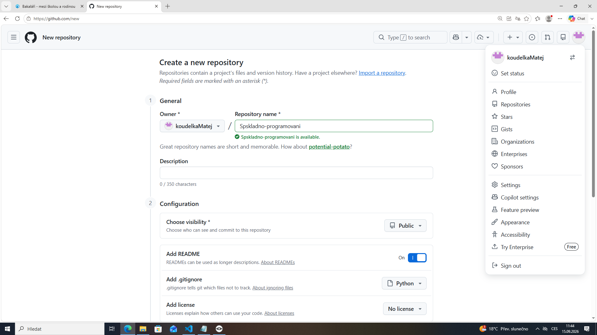
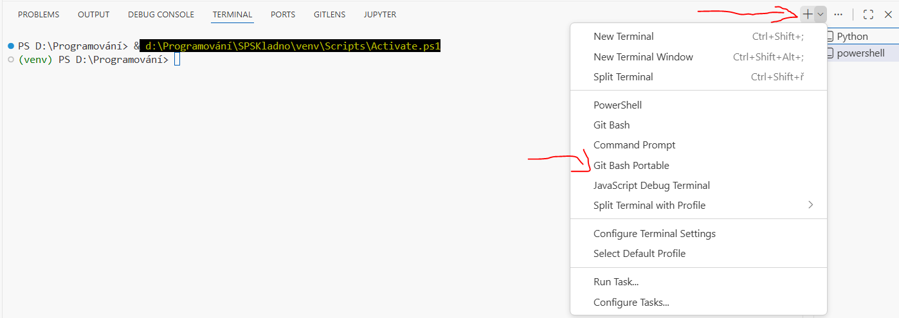

# SPSKladno 

## Nastavení VS Code, Pythonu a Gitu

Níže najdeš **4 samostatné návody**. Každý je kompletní sám o sobě – vyber si ten, který potřebuješ, a projdi ho od začátku do konce (nemusíš procházet ostatní návody).

- [Návod 1 – Nutné minimum, aby šel Python](#návod-1--nutné-minimum-aby-šel-python)
- [Návod 2 – Nutné minimum, aby šel Python + Git](#návod-2--nutné-minimum-aby-šel-python--git)
- [Návod 3 – Doporučené (jak se to dělá v reálném vývoji)](#návod-3--doporučené-jak-se-to-dělá-v-reálném-vývoji)
- [Návod 4 – Jak je to u nás na škole](#návod-4--jak-je-to-u-nás-na-škole)

Doma je potřeba nainstalovat Python (v instalaci zaškrtnout **Add Python to PATH**), VS Code a případně Git (stačí výchozí nastavení instalace). Ve škole je vše nainstalováno jako **portable verze na serveru** – přesný postup najdeš v [Návodu 4](#návod-4--jak-je-to-u-nás-na-škole).

---

## Návod 1 – Nutné minimum, aby šel Python

Tenhle návod stačí, pokud chceš jen psát a spouštět Python skripty – bez Gitu a bez virtuálního prostředí (venv), to totiž základy Pythonu nepotřebují.

### 1. Instalace Pythonu
Stáhni Python z [python.org](https://www.python.org/downloads/) a při instalaci zaškrtni **Add Python to PATH**.
> Ve škole je Python nainstalovaný jako portable – viz [Návod 4](#návod-4--jak-je-to-u-nás-na-škole).

### 2. Instalace VS Code
Stáhni a nainstaluj VS Code z [code.visualstudio.com](https://code.visualstudio.com/).
> Ve škole je VS Code nainstalováno jako portable – viz [Návod 4](#návod-4--jak-je-to-u-nás-na-škole).

### 3. Instalace rozšíření Python
V levém panelu klikni na ikonu **Extensions** (`Ctrl + Shift + X`) a nainstaluj rozšíření 
* **Python** (`ms-python.python`) od Microsoftu 
* **Jupyter** (`ms-toolsai.jupyter`) pro práci s notebooky (.ipynb).

### 4. Otevření složky projektu
Vytvoř si složku pro svůj projekt a otevři ji ve VS Code: **File → Open Folder…** (`Ctrl + K, Ctrl + O`).

### 5. Vytvoření a spuštění skriptu
Vytvoř soubor např. `main.py`, napiš do něj kód a spusť ho tlačítkem ▷ (Run) vpravo nahoře, nebo v terminálu:

```powershell
python main.py
```

### 6. Instalace balíčků (pokud je potřeba)
Pro jednoduché skripty stačí nainstalovat balíček přímo, bez venv:

```powershell
pip install nazev-balicku
```

> 💡 Jakmile pracuješ na větším projektu nebo ho sdílíš s ostatními, přejdi na [Návod 3 – Doporučené](#návod-3--doporučené-jak-se-to-dělá-v-reálném-vývoji), kde se používá virtuální prostředí.

---

## Návod 2 – Nutné minimum, aby šel Python + Git

Tenhle návod obsahuje vše potřebné pro spouštění Pythonu a navíc základní práci s Gitem, abys mohl svůj kód nahrát na GitHub.

### 1. Instalace Pythonu
Stáhni Python z [python.org](https://www.python.org/downloads/) a při instalaci zaškrtni **Add Python to PATH**.
> Ve škole je Python nainstalovaný jako portable – viz [Návod 4](#návod-4--jak-je-to-u-nás-na-škole).

### 2. Instalace VS Code a Gitu
Stáhni a nainstaluj VS Code z [code.visualstudio.com](https://code.visualstudio.com/) a Git z [git-scm.com](https://git-scm.com/) (stačí výchozí nastavení instalace).
> Ve škole je vše nainstalováno jako portable – viz [Návod 4](#návod-4--jak-je-to-u-nás-na-škole).

### 3. Instalace rozšíření Python
V levém panelu klikni na ikonu **Extensions** (`Ctrl + Shift + X`) a nainstaluj rozšíření 
* **Python** (`ms-python.python`) od Microsoftu 
* **Jupyter** (`ms-toolsai.jupyter`) pro práci s notebooky (.ipynb).

### 4. Nastavení Git identity
Otevři terminál (`ctrl + ;`) a zadej po jednom řádku:

```bash
git config --global user.email "tvuj@email.cz"
```
```bash
git config --global user.name "TvujNick"
```
```bash
git config --global credential.helper store
```

> 🔁 Nahraď `"tvuj@email.cz"` a `"TvujNick"` svými skutečnými údaji (např. z GitHubu).
### 5. Otevření a práce s projektem
**File → Open Folder…** (`Ctrl + K, Ctrl + O`) → vyber naklonovanou složku. Změny commituješ a pushuješ přes panel **Source Control** (`Ctrl + Shift + G`).

### 6. Vytvoření Git repozitáře
Založ repozitář na GitHubu – vpravo nahoře klikni na ikonku profilu a vyber `Repositories` → `New`. Doporučuji rovnou zaškrtnout add `README.md` a `.gitignore` pro Python projekty.



### 7. Naklonování repozitáře
Na stránce repozitáře klikni na zelené tlačítko `Code` a zkopíruj HTTPS adresu:

```bash
git clone https://github.com/uzivatel/nazev-repozitare.git 
```

Případně přes VS Code:
1. Otevři příkazovou paletu (`Ctrl + Shift + P`)
2. Zadej **"Git: Clone"**
3. Vlož URL repozitáře a vyber cílovou složku


### 8. Instalace balíčků (pokud je potřeba)
```powershell
pip install nazev-balicku
```

---

## Návod 3 – Doporučené (jak se to dělá v reálném vývoji)

Tenhle návod ukazuje kompletní postup tak, jak se běžně pracuje na reálných projektech – navíc oproti Návodu 2 přidává virtuální prostředí (venv) a `requirements.txt`.

> **Proč jinak než v Návodu 1?** V Návodu 1 jde jen o to, aby jeden skript fungoval u tebe na počítači. V reálném projektu ale kód sdílíš s dalšími lidmi (spolužáci, kolegové, učitel), pracuješ na něm dlouhodobě a časem k němu přidáváš další balíčky. Proto se navíc používá Git (verzování a sdílení kódu) a venv s `requirements.txt` (aby projekt šel spustit stejně na jakémkoliv jiném počítači).

### 1. Instalace Pythonu
Stáhni Python z [python.org](https://www.python.org/downloads/) a při instalaci zaškrtni **Add Python to PATH**.
> Ve škole je Python nainstalovaný jako portable – viz [Návod 4](#návod-4--jak-je-to-u-nás-na-škole).

### 2. Instalace VS Code a Gitu
Stáhni a nainstaluj VS Code z [code.visualstudio.com](https://code.visualstudio.com/) a Git z [git-scm.com](https://git-scm.com/).
> Ve škole je vše nainstalováno jako portable – viz [Návod 4](#návod-4--jak-je-to-u-nás-na-škole).

### 3. Instalace rozšíření Python
`Ctrl + Shift + X` → nainstaluj rozšíření 
* **Python** (`ms-python.python`) od Microsoftu 
* **Jupyter** (`ms-toolsai.jupyter`) pro práci s notebooky (.ipynb).

### 4. Nastavení Git identity
```bash
git config --global user.email "tvuj@email.cz"
```
```bash
git config --global user.name "TvujNick"
```
```bash
git config --global credential.helper store
```

> **Proč:** Na rozdíl od Návodu 1 tu kód neexistuje jen lokálně, ale je uložený i na GitHubu – Git identita říká, kdo jednotlivé změny (commity) udělal.

### 5. Otevření složky projektu
**File → Open Folder…** (`Ctrl + K, Ctrl + O`) → vyber naklonovanou složku.

### 6. Vytvoření a naklonování Git repozitáře
Založ repozitář na GitHubu (viz obrázek) a naklonuj ho:


```bash
git clone https://github.com/uzivatel/nazev-repozitare.git
```

> **Proč:** Repozitář na GitHubu slouží jako zálohovaná a sdílená kopie projektu – kdokoliv si ho může naklonovat a pokračovat na stejném kódu. V Návodu 1 kód existuje jen jako soubor na disku.

### 7. Povolení spouštění skriptů (jen Windows, pokud hlásí chybu krok 9 , kde je nutné administrátorské oprávnění)
```powershell
Set-ExecutionPolicy -Scope CurrentUser -ExecutionPolicy RemoteSigned
```

### 8. Vytvoření virtuálního prostředí (venv)
Virtuální prostředí izoluje balíčky projektu od zbytku systému:

```powershell
python -m venv venv
```

> **Proč:** V Návodu 1 se balíček nainstaluje přímo do systémového Pythonu – to stačí pro jeden skript, ale u více projektů najednou by se různé verze balíčků mohly navzájem přepisovat a rozbíjet. Venv dá každému projektu vlastní, oddělené prostředí.

### 9. Aktivace virtuálního prostředí
```powershell
.\venv\Scripts\activate
```

### 10. Instalace balíčků do venv
```powershell
pip install flask
pip install pandas matplotlib
```

Pokud projekt obsahuje `requirements.txt` (např. po naklonování z GitHubu):

```powershell
pip install -r requirements.txt
```

### 11. Uložení závislostí (pip freeze)
```powershell
pip freeze > requirements.txt
```

Tento soubor **commitni do Gitu** spolu s projektem – kdokoliv pak nainstaluje stejné balíčky příkazem `pip install -r requirements.txt`.

> 💡 Vždy po instalaci nového balíčku aktualizuj `requirements.txt` příkazem výše.

> **Proč:** V Návodu 1 balíčky nikdo jiný řešit nemusí, protože je tam většinou jen jeden skript bez závislostí. U reálného projektu ale potřebuješ, aby si kdokoliv jiný (nebo ty sám na jiném PC) nainstaloval přesně stejné balíčky – bez `requirements.txt` by musel zjišťovat, co všechno je potřeba, ručně.

### Další dobré zvyky
- Nikdy necommituj složku `venv/` ani jiné velké/generované soubory – k tomu slouží `.gitignore`.
- Piš srozumitelné commit zprávy (co a proč se změnilo, ne jen "oprava").
- Commituj často a po menších funkčních celcích, ne jednu obří změnu na konci.
- Před začátkem práce si stáhni nejnovější změny (`git pull`), ať nepřepisuješ práci ostatních.

---

## Návod 4 – Jak je to u nás na škole + Best Practices

Ve škole je Python, Git i VS Code nainstalováno jako **portable verze na serveru**. Tenhle návod obsahuje kompletní postup se školními specifiky (od nastavení VS Code až po venv).

### 1. Nastavení VS Code (settings.json)
Otevři příkazovou paletu (`Ctrl + Shift + P`) → zadej **"Open User Settings (JSON)"** a vlož následující konfiguraci:

```json
{
  "terminal.integrated.profiles.windows": {
    "Git Bash Portable": {
      "path": "G:/win32app/git_portable/bin/bash.exe",
      "args": ["--login", "-i"]
    }
  },
  "git.path": "G:/win32app/git_portable/cmd/git.exe",
  "git.enabled": true,
  "files.autoSave": "afterDelay",
  "git.enableSmartCommit": true,
  "git.autofetch": "all"
}
```

> ⚠️ Pokud už v souboru nějaké nastavení máš, přidej pouze jednotlivé položky – neduplikuj vnější složené závorky `{}`.

Po uložení (`ctrl + s`) a zavření souboru `settings.json` vypněte a zapněte VS Code, případně (`Ctrl + Shift + P`) a `Reload Window`.

### 2. Instalace rozšíření Python
V levém panelu klikni na ikonu **Extensions** (`Ctrl + Shift + X`) a nainstaluj rozšíření 
* **Python** (`ms-python.python`) od Microsoftu 
* **Jupyter** (`ms-toolsai.jupyter`) pro práci s notebooky (.ipynb).

### 3. Nastavení Git identity
Otevři terminál (`ctrl + ;`) → **Git Bash Portable** (v dolní liště VS Code vyber profil terminálu – vedle pluska malý zobáček dolů):



```bash
git config --global user.email "tvuj@email.cz"
```
```bash
git config --global user.name "TvujNick"
```
```bash
git config --global credential.helper store
```

> Pokud při prvním pushnutí (Commit/Sync) git hlásí chybu `user.name a user.email`, spusť tyto tři příkazy přímo v (`G:\win32app\git_portable\bin\bash.exe`) resp. (`aplikace SPŠ a VOŠ/git_portable_bash`).

### 4. Otevření složky projektu
**File → Open Folder…** (`Ctrl + K, Ctrl + O`) → vyber složku projektu, kam budeš ukládat svůj kód.

> **Doporučuji vytvoření složky na disku D: např. D:\programovani_prijemni**

### 5. Vytvoření a naklonování Git repozitáře
Založ repozitář na GitHubu (vpravo nahoře ikonka profilu → `Repositories` → `New`, doporučuji zaškrtnout `README.md` a `.gitignore` pro Python projekty) a naklonuj ho:


V terminálu **Git Bash Portable** ho naklonuj (odkaz najdeš na stránce repozitáře pod zeleným tlačítkem `Code` → `HTTPS`):

```bash
git clone https://github.com/uzivatel/nazev-repozitare.git
```
Případně přes VS Code:

Otevři příkazovou paletu (Ctrl + Shift + P)
Zadej "Git: Clone"
Vlož URL repozitáře a vyber cílovou složku z kroku 4.

### 6. Povolení spouštění skriptů
Školní politika resetuje toto nastavení po každém restartu PC. **tento příkaz musíš spustit pokaždé když budeš chtít měnit a instalovat balíčky/knihovny v virtuálním prostředí (venv) v kroku 8.**

Otevři terminál (`ctrl + ;`) -> **PowerShell** případně jen tlačítko `+`:

```powershell
Set-ExecutionPolicy -Scope CurrentUser -ExecutionPolicy RemoteSigned
```

### 7. Vytvoření virtuálního prostředí (venv)
Použij cestu k portable Pythonu na serveru:

```powershell
& "G:/win32app/Portable Python-3.13.3 x64/python.exe" -m venv venv
```

### 8. Aktivace virtuálního prostředí
```powershell
.\venv\Scripts\activate
```

### 9. Instalace balíčků a uložení requirements.txt
```powershell
pip install nazev-balicku
pip freeze > requirements.txt
```
